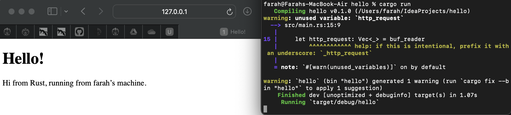
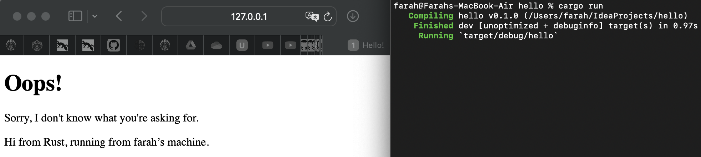

<h3>Farah Aura Rosadi - 2206824773 - Pemrograman Lanjut B</h3>

<h3>Commit 1</h3>
<h4>What is inside the handle_connection method?</h4>
Fungsi handle_connection bertanggung jawab untuk memproses aliran TCP yang masuk. Ketika handle_connection membaca TCP stream, itu akan membaca setiap baris dari stream tersebut hingga menemui baris kosong. Setelah baris kosong ditemui, akan mengumpulkan semua baris ini ke dalam sebuah vektor yang kemudian akan dicetak sebagai permintaan HTTP untuk inspeksi.

<h3>Commit 2</h3>
<h4>What you have learned about the new code the handle_connection?</h4>
Fungsi handle_connection yang dimodifikasi dapat mengirimkan respons HTTP kembali ke client. Baris tambahan dalam fungsi tersebut mengatur status_line yang menandakan bahwa respons HTTP adalah 200 OK, menandakan keberhasilan permintaan. Selanjutnya, fungsi tersebut membaca isi dari file bernama hello.html ke dalam sebuah string menggunakan fs::read_to_string(). Langkah ini berarti ada file bernama hello.html dalam direktori yang sama dengan file eksekusi. Setelah itu, panjang string konten dihitung, dan respons HTTP diformat termasuk status line, panjang konten, dan isi dari file hello.html. Respons tersebut kemudian dikirimkan kembali ke klien melalui TCP stream menggunakan write_all(). Dapat disimpulkan, fungsi handle_connection yang dimodifikasi membaca isi file hello.html, menyusun respons HTTP dengan status 200 OK, dan mengirimkannya kembali ke klien melalui TCP stream.

<h3>Commit 3</h3>
<h4>How to split between response and why the refactoring is needed?</h4>
Langkah pertama, saya menambahkan file html baru bernama 404.html untuk tampilannya. Kemudian, saya memodifikasi fungsi handle_connection. Fungsi handle_connection yang saya modifikasi berfungsi sebagai server HTTP sederhana. Fungsi ini membaca baris permintaan dari permintaan HTTP client dan memeriksa apakah itu permintaan GET / HTTP/1.1 atau bukan. Berdasarkan pemeriksaan ini, jika permintaan adalah untuk jalur root, maka akan merespons dengan garis status HTTP/1.1 200 OK, membaca konten dari file bernama hello.html, menghitung panjangnya, membangun respons HTTP yang berisi konten ini, dan mengirimkannya kembali ke client. Namun, jika permintaan bukan untuk jalur root, maka akan merespons dengan garis status HTTP/1.1 404 NOT FOUND, membaca konten dari file bernama 404.html, menghitung panjangnya, membangun respons HTTP yang berisi konten ini, dan mengirimkannya kembali ke client. Dapat disimpulkan, fungsi handle_connection yang dimodifikasi ini melayani konten yang berbeda berdasarkan permintaan.

<h3>Commit 4</h3>
<h4>Why it works like that??</h4>
Dalam fungsi handle_connection yang dimodifikasi, terdapat beberapa perubahan untuk menangani permintaan tertentu, yaitu GET /sleep HTTP/1.1. Jika permintaan adalah GET / HTTP/1.1, maka respons adalah HTTP/1.1 200 OK dengan konten dari hello.html. Namun, jika permintaan adalah GET /sleep HTTP/1.1, server akan delay selama 10 detik sebelum memberikan respons dengan konten dari hello.html. Jika permintaan tidak cocok, respons adalah HTTP/1.1 404 NOT FOUND dengan konten dari 404.html. Setelah menentukan respons, konten file dibaca dan respons HTTP yang sesuai dibangun sebelum ditulis kembali ke client melalui aliran TCP.

<h3>Commit 5</h3>
<h4>How the ThreadPool works?</h4>
Cara kerja dimulai dengan inisialisasi ThreadPool dimana pool thread dibuat dengan jumlah thread worker tertentu serta untuk komunikasi antara thread main dan worker. Setiap thread worker dibuat dengan sebuah closure yang berjalan dalam sebuah infinite loop, menunggu pekerjaan dan menjalankannya saat diterima. Pekerjaan dikirim melalui channel kepada thread worker yang tersedia untuk dieksekusi. Konsep konkurensi diimplementasikan dengan menggunakan Arc<Mutex<mpsc::Receiver<Job>>>, memastikan akses yang aman terhadap channel oleh beberapa thread worker secara bersamaan. Dengan channel mpsc, tugas dapat dikirim dan dieksekusi secara paralel oleh thread worker, menghasilkan mekanisme yang sederhana namun efektif untuk manajemen eksekusi tugas.

<h3>Commit 6</h3>
<h4>Function improvement</h4>
Dalam buku Rust, disarankan untuk menggunakan method build daripada new saat menginisialisasi ThreadPool karena new dapat menyebabkan kesalahan jika jumlah thread yang diberikan terlalu kecil. Namun, argumen ini tidak tepat karena ekspektasi dari method new adalah success. Oleh karena itu, disarankan untuk mengganti method new dengan build yang akan return Result. Kemudian, ketika value tersebut di-return ke pemanggil, itu dapat di-unwrapped untuk mendapatkan nilai hasil eksekusi. Penggunaan method build yang mengembalikan Result disarankan karena memberikan kemampuan untuk menangani kemungkinan kesalahan yang mungkin terjadi saat inisialisasi ThreadPool.